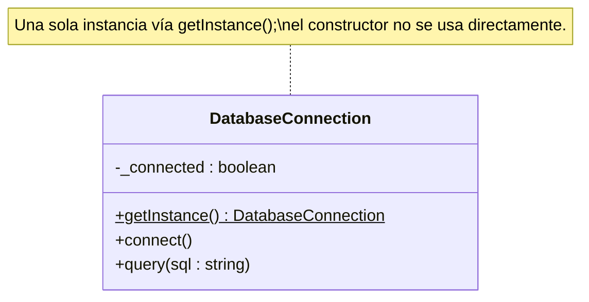
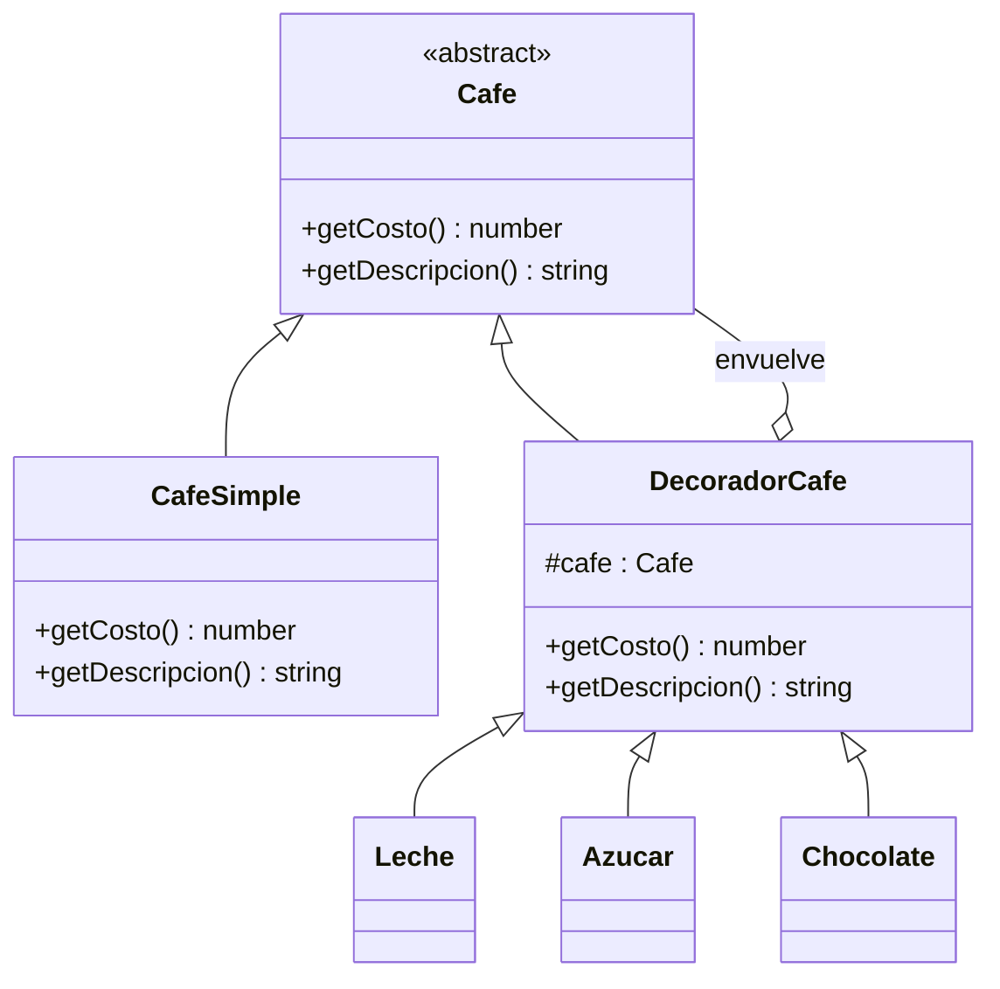
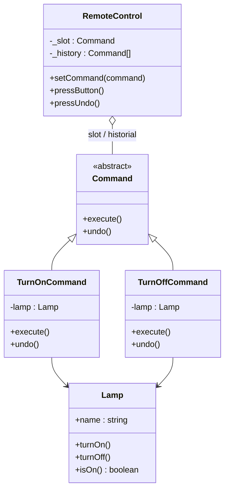
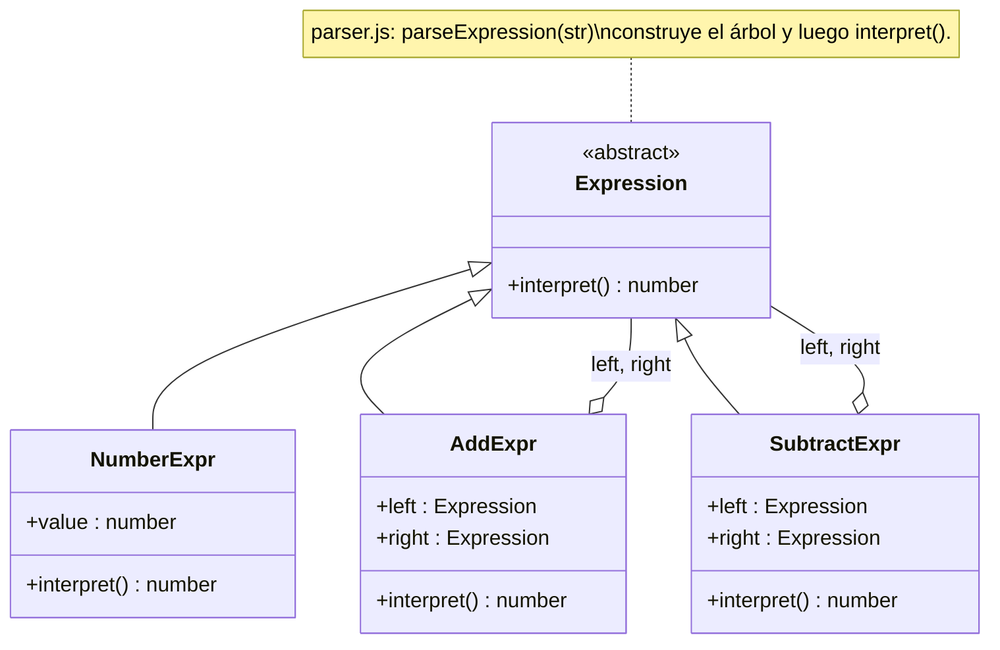
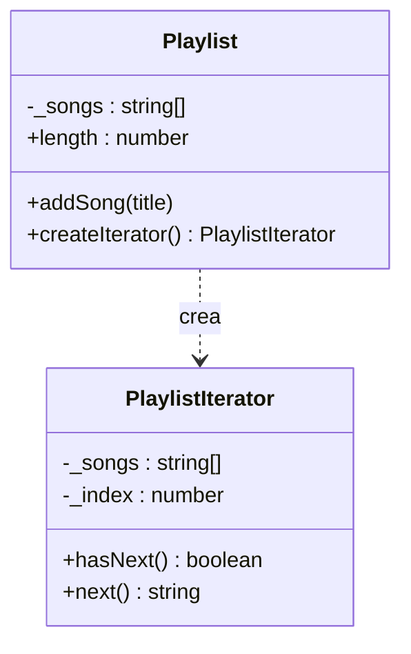
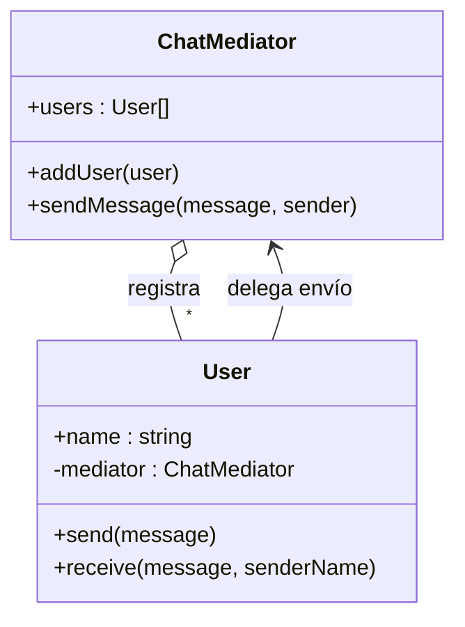
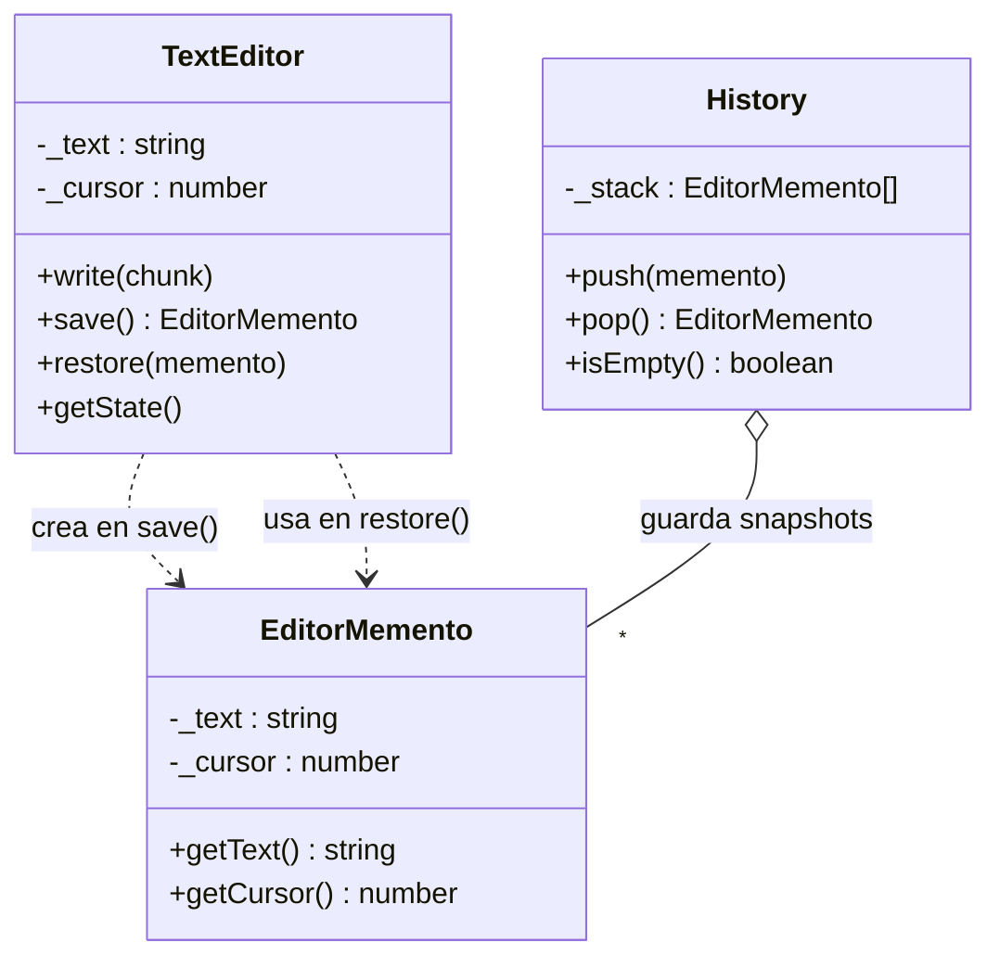

# Diagramas UML (Mermaid) — patrones del proyecto

Cada bloque es un `classDiagram` que puedes pegar en GitHub, Notion o en un visor Mermaid.

---

## Singleton (`Singleton/`)

---

## Decorator (`Decorator/`)

---

## Command (`Command/`)

---

## Interpreter (`Interpreter/`)

---

## Iterator (`Iterator/`)

---

## Mediator (`Mediator/`)

---

## Memento (`Memento/`)

---
