# Diagramas UML (Mermaid) — patrones del proyecto

Diagramas de clases alineados con el código de este repo. En GitHub se renderizan los bloques ` ```mermaid ` en la vista del archivo.

## Índice

| Patrón | Carpeta |
|--------|---------|
| [Singleton](#singleton-singleton) | `Singleton/` |
| [Decorator](#decorator-decorator) | `Decorator/` |
| [Command](#command-command) | `Command/` |
| [Interpreter](#interpreter-interpreter) | `Interpreter/` |
| [Iterator](#iterator-iterator) | `Iterator/` |
| [Mediator](#mediator-mediator) | `Mediator/` |
| [Memento](#memento-memento) | `Memento/` |
| [Abstract Factory](#abstract-factory-abstract_factory) | `abstract_factory/` |
| [Adapter](#adapter-adapter) | `Adapter/` |
| [Bridge](#bridge-bridge) | `Bridge/` |
| [Builder](#builder-builder) | `builder/` |
| [Chain of Responsibility](#chain-of-responsibility-chain-of-responsability) | `Chain of responsability/` |
| [Composite](#composite-composite) | `composite/` |
| [Facade](#facade-facade) | `Facade/` |
| [Factory Method](#factory-method-factory_method) | `factory_method/` |
| [Flyweight](#flyweight-flyweight) | `flyweight/` |
| [Observer](#observer-observer) | `observer/` |
| [Prototype](#prototype-prototype) | `prototype/` |
| [Proxy](#proxy-proxy) | `Proxy/` |
| [State](#state-state) | `state/` |
| [Strategy](#strategy-strategy) | `strategy/` |
| [Template Method](#template-method-template_method) | `template_method/` |
| [Visitor](#visitor-visitor) | `visitor/` |

---

## Singleton (`Singleton/`)

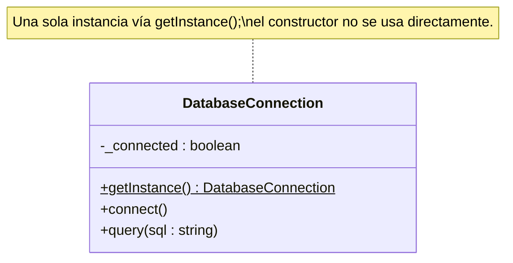
```mermaid
classDiagram
  class DatabaseConnection {
    -_connected : boolean
    +getInstance()$ DatabaseConnection
    +connect()
    +query(sql : string)
  }
  note for DatabaseConnection "Una sola instancia vía getInstance();\nel constructor no se usa directamente."
```

---

## Decorator (`Decorator/`)

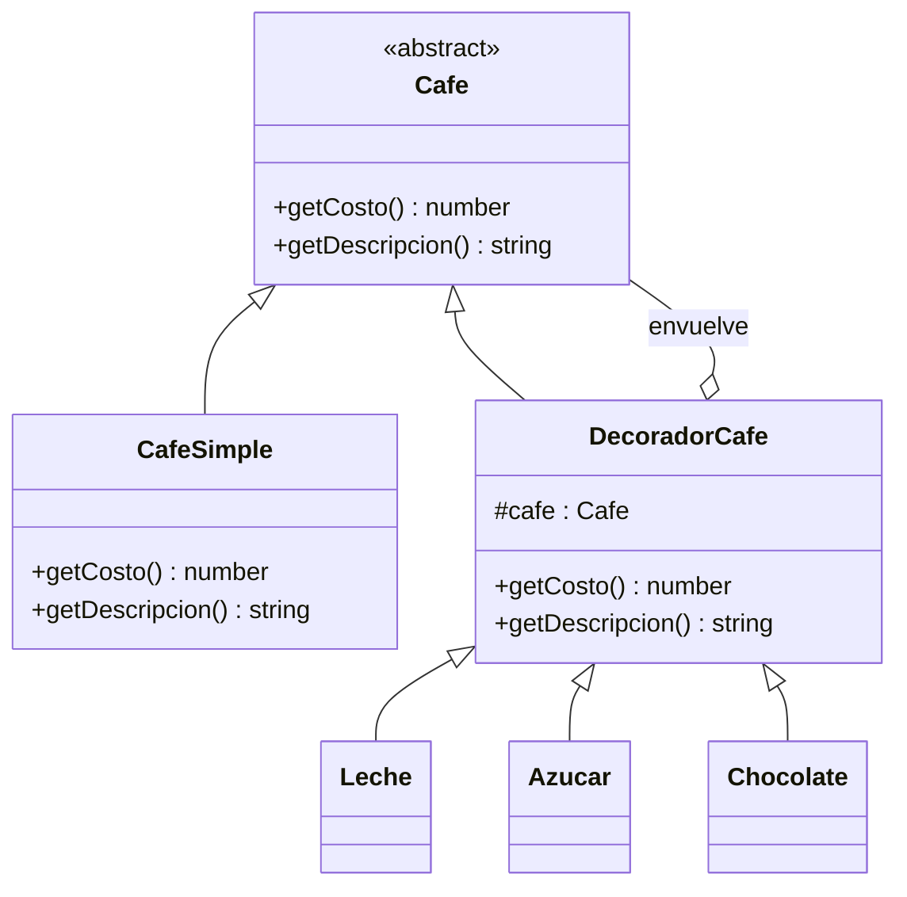
```mermaid
classDiagram
  class Cafe {
    <<abstract>>
    +getCosto() number
    +getDescripcion() string
  }
  class CafeSimple {
    +getCosto() number
    +getDescripcion() string
  }
  class DecoradorCafe {
    #cafe : Cafe
    +getCosto() number
    +getDescripcion() string
  }
  class Leche
  class Azucar
  class Chocolate

  Cafe <|-- CafeSimple
  Cafe <|-- DecoradorCafe
  DecoradorCafe <|-- Leche
  DecoradorCafe <|-- Azucar
  DecoradorCafe <|-- Chocolate
  DecoradorCafe o-- Cafe : envuelve
```

---

## Command (`Command/`)

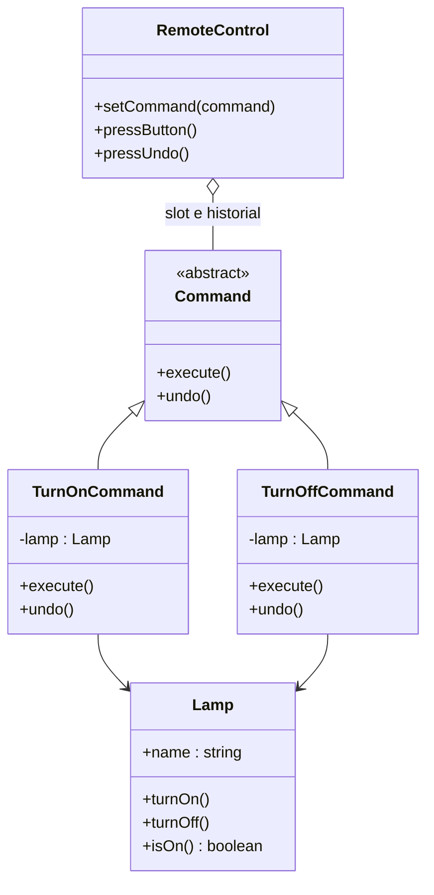
```mermaid
classDiagram
  class Command {
    <<abstract>>
    +execute()
    +undo()
  }
  class TurnOnCommand {
    -lamp : Lamp
    +execute()
    +undo()
  }
  class TurnOffCommand {
    -lamp : Lamp
    +execute()
    +undo()
  }
  class RemoteControl {
    +setCommand(command)
    +pressButton()
    +pressUndo()
  }
  class Lamp {
    +name : string
    +turnOn()
    +turnOff()
    +isOn() boolean
  }

  Command <|-- TurnOnCommand
  Command <|-- TurnOffCommand
  TurnOnCommand --> Lamp
  TurnOffCommand --> Lamp
  RemoteControl o-- Command : slot e historial
```

---

## Interpreter (`Interpreter/`)

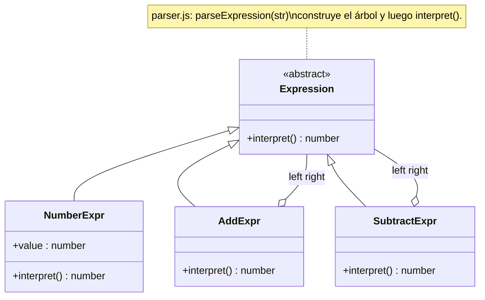
```mermaid
classDiagram
  class Expression {
    <<abstract>>
    +interpret() number
  }
  class NumberExpr {
    +value : number
    +interpret() number
  }
  class AddExpr {
    +interpret() number
  }
  class SubtractExpr {
    +interpret() number
  }

  Expression <|-- NumberExpr
  Expression <|-- AddExpr
  Expression <|-- SubtractExpr
  AddExpr o-- Expression : left right
  SubtractExpr o-- Expression : left right

  note for Expression "parser.js: parseExpression(str)\nconstruye el árbol y luego interpret()."
```

---

## Iterator (`Iterator/`)

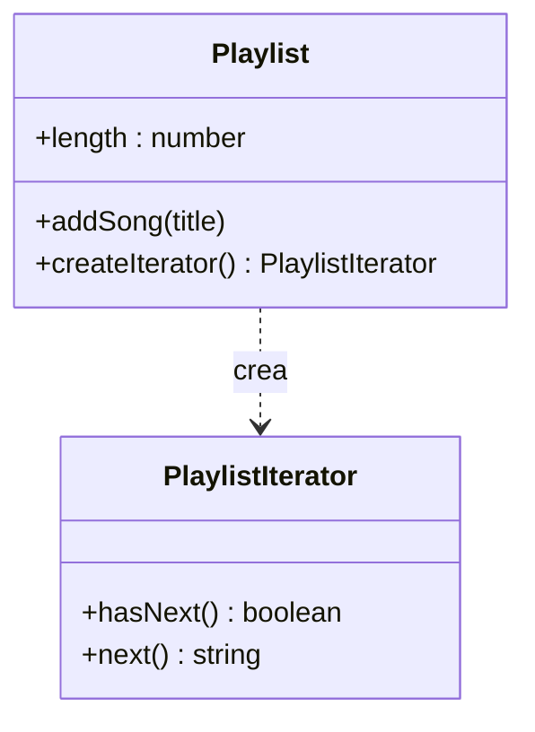
```mermaid
classDiagram
  class Playlist {
    +addSong(title)
    +createIterator() PlaylistIterator
    +length : number
  }
  class PlaylistIterator {
    +hasNext() boolean
    +next() string
  }

  Playlist ..> PlaylistIterator : crea
```

---

## Mediator (`Mediator/`)

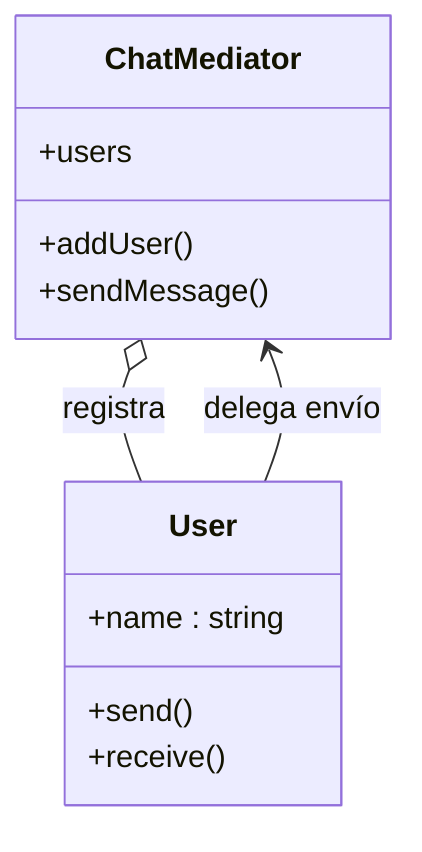
```mermaid
classDiagram
  class ChatMediator {
    +users
    +addUser()
    +sendMessage()
  }
  class User {
    +name : string
    +send()
    +receive()
  }

  ChatMediator o-- User : registra
  User --> ChatMediator : delega envío
```

---

## Memento (`Memento/`)

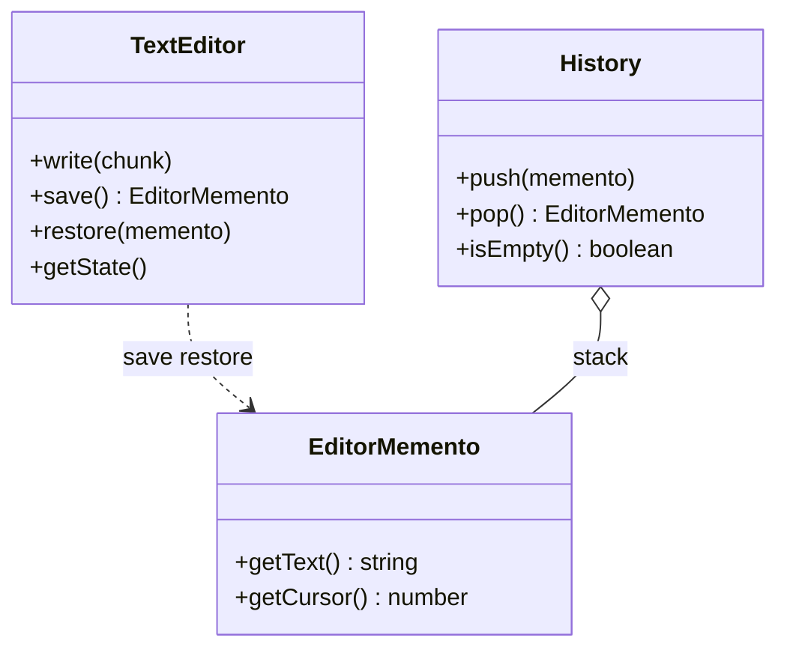
```mermaid
classDiagram
  class EditorMemento {
    +getText() string
    +getCursor() number
  }
  class TextEditor {
    +write(chunk)
    +save() EditorMemento
    +restore(memento)
    +getState()
  }
  class History {
    +push(memento)
    +pop() EditorMemento
    +isEmpty() boolean
  }

  TextEditor ..> EditorMemento : save restore
  History o-- EditorMemento : stack
```

---

## Abstract Factory (`abstract_factory/`)

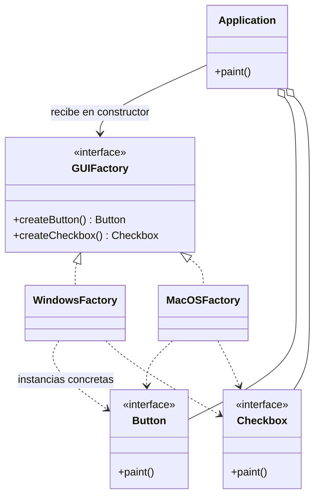
```mermaid
classDiagram
  class GUIFactory {
    <<interface>>
    +createButton() Button
    +createCheckbox() Checkbox
  }
  class Button {
    <<interface>>
    +paint()
  }
  class Checkbox {
    <<interface>>
    +paint()
  }
  class WindowsFactory
  class MacOSFactory
  class Application {
    +paint()
  }

  GUIFactory <|.. WindowsFactory
  GUIFactory <|.. MacOSFactory
  Application --> GUIFactory : recibe en constructor
  Application o-- Button
  Application o-- Checkbox
  WindowsFactory ..> Button : instancias concretas
  WindowsFactory ..> Checkbox
  MacOSFactory ..> Button
  MacOSFactory ..> Checkbox
```

---

## Adapter (`Adapter/`)

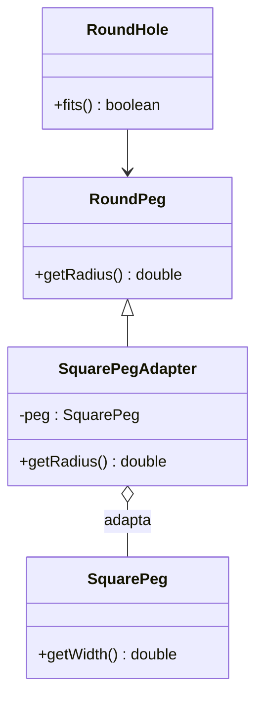
```mermaid
classDiagram
  class RoundHole {
    +fits() boolean
  }
  class RoundPeg {
    +getRadius() double
  }
  class SquarePeg {
    +getWidth() double
  }
  class SquarePegAdapter {
    -peg : SquarePeg
    +getRadius() double
  }

  RoundHole --> RoundPeg
  RoundPeg <|-- SquarePegAdapter
  SquarePegAdapter o-- SquarePeg : adapta
```

---

## Bridge (`Bridge/`)

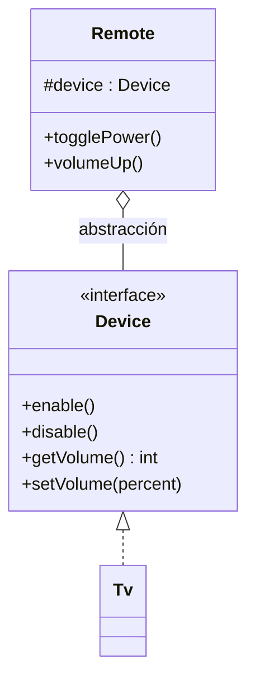
```mermaid
classDiagram
  class Device {
    <<interface>>
    +enable()
    +disable()
    +getVolume() int
    +setVolume(percent)
  }
  class Tv
  class Remote {
    #device : Device
    +togglePower()
    +volumeUp()
  }

  Device <|.. Tv
  Remote o-- Device : abstracción
```

---

## Builder (`builder/`)

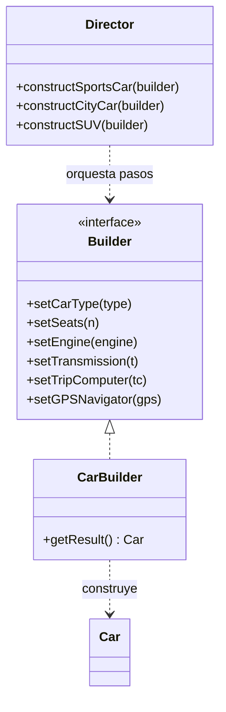
```mermaid
classDiagram
  class Builder {
    <<interface>>
    +setCarType(type)
    +setSeats(n)
    +setEngine(engine)
    +setTransmission(t)
    +setTripComputer(tc)
    +setGPSNavigator(gps)
  }
  class CarBuilder {
    +getResult() Car
  }
  class Director {
    +constructSportsCar(builder)
    +constructCityCar(builder)
    +constructSUV(builder)
  }
  class Car

  Builder <|.. CarBuilder
  Director ..> Builder : orquesta pasos
  CarBuilder ..> Car : construye
```

---

## Chain of Responsibility (`Chain of responsability/`)

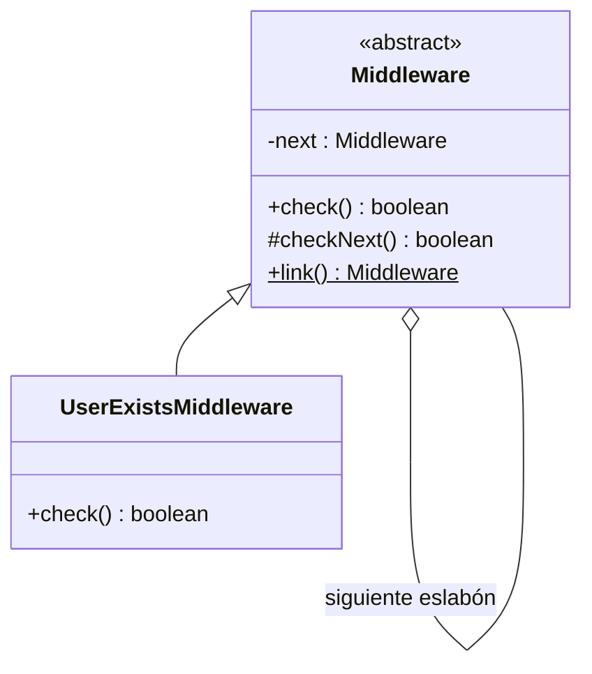
```mermaid
classDiagram
  class Middleware {
    <<abstract>>
    -next : Middleware
    +check() boolean
    #checkNext() boolean
    +link()$ Middleware
  }
  class UserExistsMiddleware {
    +check() boolean
  }

  Middleware <|-- UserExistsMiddleware
  Middleware o-- Middleware : siguiente eslabón
```

---

## Composite (`composite/`)

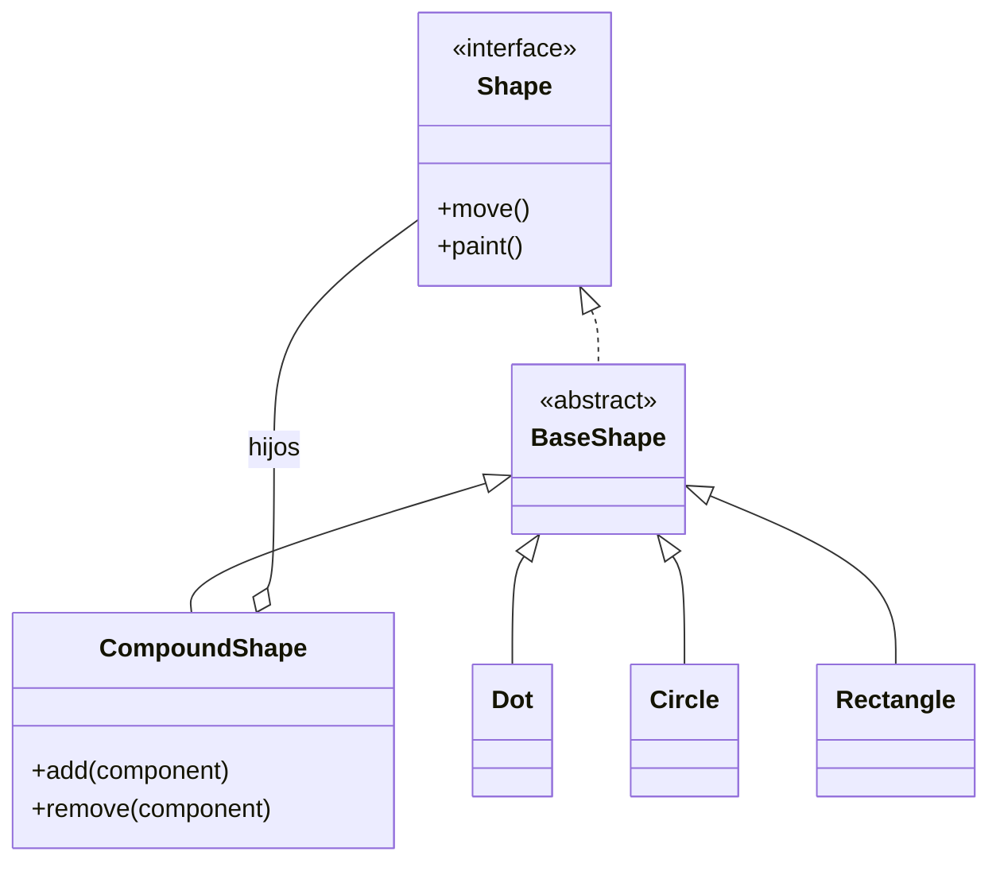
```mermaid
classDiagram
  class Shape {
    <<interface>>
    +move()
    +paint()
  }
  class BaseShape {
    <<abstract>>
  }
  class CompoundShape {
    +add(component)
    +remove(component)
  }
  class Dot
  class Circle
  class Rectangle

  Shape <|.. BaseShape
  BaseShape <|-- CompoundShape
  BaseShape <|-- Dot
  BaseShape <|-- Circle
  BaseShape <|-- Rectangle
  CompoundShape o-- Shape : hijos
```

---

## Facade (`Facade/`)

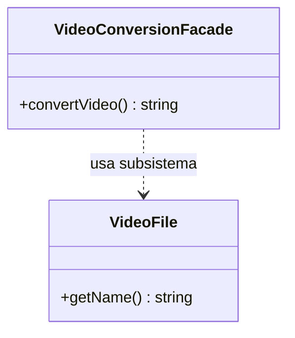
```mermaid
classDiagram
  class VideoConversionFacade {
    +convertVideo() string
  }
  class VideoFile {
    +getName() string
  }

  VideoConversionFacade ..> VideoFile : usa subsistema
```

---

## Factory Method (`factory_method/`)

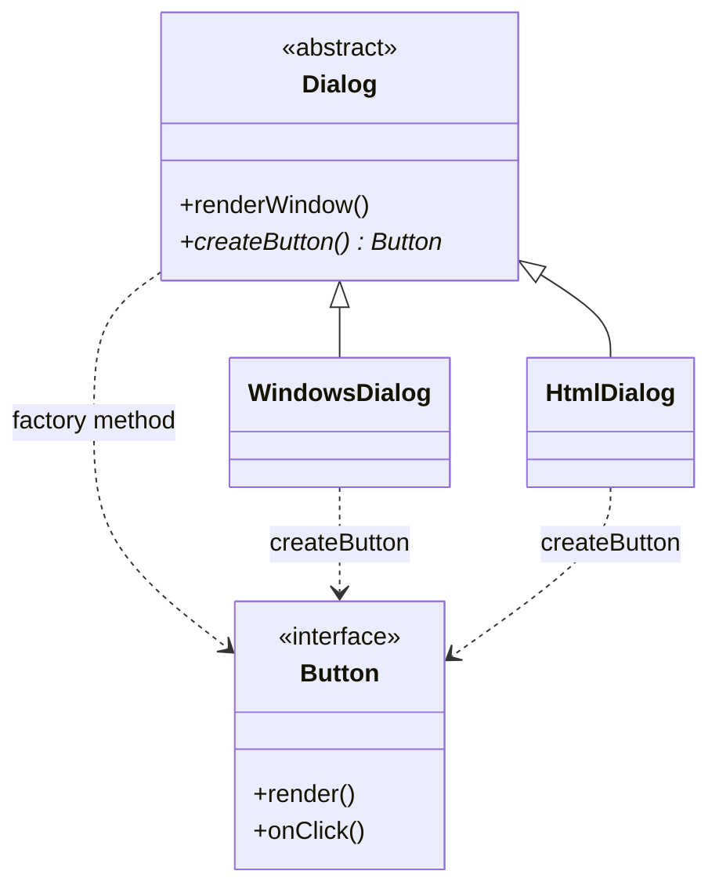
```mermaid
classDiagram
  class Dialog {
    <<abstract>>
    +renderWindow()
    +createButton()* Button
  }
  class WindowsDialog
  class HtmlDialog
  class Button {
    <<interface>>
    +render()
    +onClick()
  }

  Dialog <|-- WindowsDialog
  Dialog <|-- HtmlDialog
  Dialog ..> Button : factory method
  WindowsDialog ..> Button : createButton
  HtmlDialog ..> Button : createButton
```

---

## Flyweight (`flyweight/`)

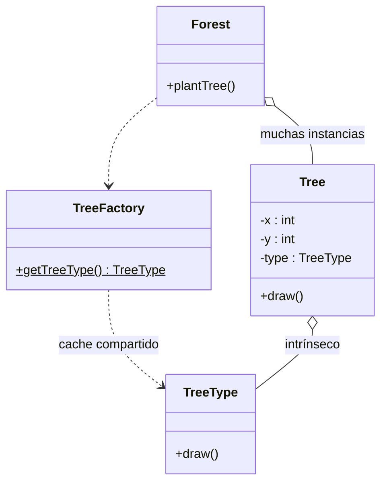
```mermaid
classDiagram
  class TreeFactory {
    +getTreeType()$ TreeType
  }
  class TreeType {
    +draw()
  }
  class Tree {
    -x : int
    -y : int
    -type : TreeType
    +draw()
  }
  class Forest {
    +plantTree()
  }

  TreeFactory ..> TreeType : cache compartido
  Tree o-- TreeType : intrínseco
  Forest ..> TreeFactory
  Forest o-- Tree : muchas instancias
```

---

## Observer (`observer/`)

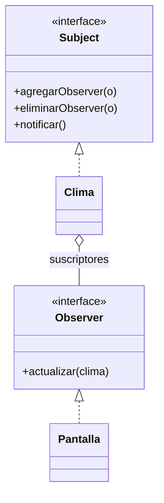
```mermaid
classDiagram
  class Subject {
    <<interface>>
    +agregarObserver(o)
    +eliminarObserver(o)
    +notificar()
  }
  class Observer {
    <<interface>>
    +actualizar(clima)
  }
  class Clima
  class Pantalla

  Subject <|.. Clima
  Observer <|.. Pantalla
  Clima o-- Observer : suscriptores
```

---

## Prototype (`prototype/`)

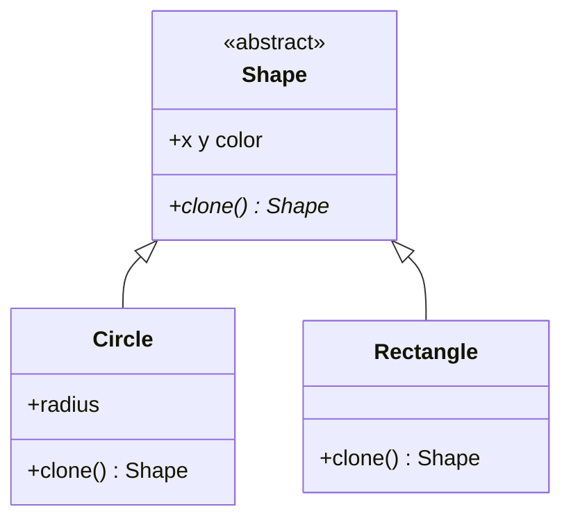
```mermaid
classDiagram
  class Shape {
    <<abstract>>
    +x y color
    +clone()* Shape
  }
  class Circle {
    +radius
    +clone() Shape
  }
  class Rectangle {
    +clone() Shape
  }

  Shape <|-- Circle
  Shape <|-- Rectangle
```

---

## Proxy (`Proxy/`)

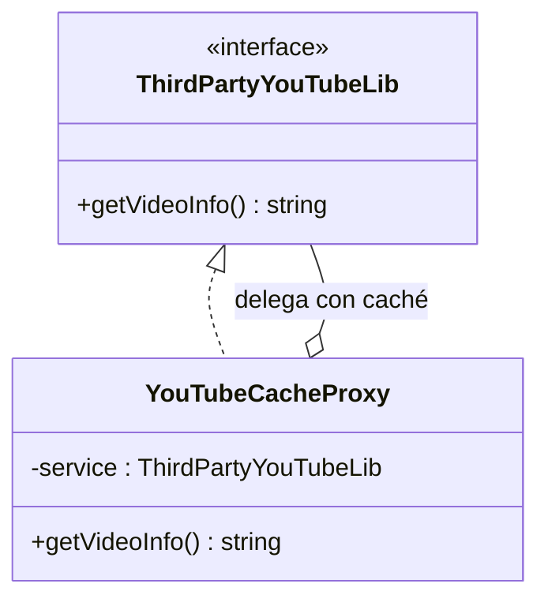
```mermaid
classDiagram
  class ThirdPartyYouTubeLib {
    <<interface>>
    +getVideoInfo() string
  }
  class YouTubeCacheProxy {
    -service : ThirdPartyYouTubeLib
    +getVideoInfo() string
  }

  ThirdPartyYouTubeLib <|.. YouTubeCacheProxy
  YouTubeCacheProxy o-- ThirdPartyYouTubeLib : delega con caché
```

---

## State (`state/`)

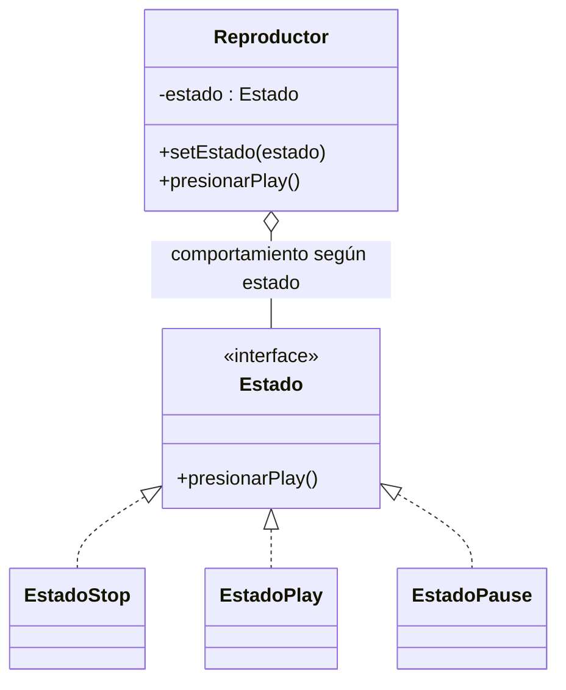
```mermaid
classDiagram
  class Estado {
    <<interface>>
    +presionarPlay()
  }
  class Reproductor {
    -estado : Estado
    +setEstado(estado)
    +presionarPlay()
  }
  class EstadoStop
  class EstadoPlay
  class EstadoPause

  Estado <|.. EstadoStop
  Estado <|.. EstadoPlay
  Estado <|.. EstadoPause
  Reproductor o-- Estado : comportamiento según estado
```

---

## Strategy (`strategy/`)

```mermaid
classDiagram
  class EstrategiaPago {
    <<interface>>
    +pagar(monto)
  }
  class Pago {
    -estrategia : EstrategiaPago
    +setEstrategia(e)
    +ejecutarPago(monto)
  }
  class PagoTarjeta
  class PagoPayPal
  class PagoEfectivo

  EstrategiaPago <|.. PagoTarjeta
  EstrategiaPago <|.. PagoPayPal
  EstrategiaPago <|.. PagoEfectivo
  Pago o-- EstrategiaPago : intercambiable
```

---

## Template Method (`template_method/`)

```mermaid
classDiagram
  class Bebida {
    <<abstract>>
    +preparar()
    +hervirAgua()
    +prepararIngrediente()*
    +servir()
    +agregarExtras()
  }
  class Cafe {
    +prepararIngrediente()
  }
  class Te {
    +prepararIngrediente()
  }

  Bebida <|-- Cafe
  Bebida <|-- Te
```

---

## Visitor (`visitor/`)

```mermaid
classDiagram
  class Figura {
    <<interface>>
    +accept(visitor)
  }
  class Visitor {
    <<interface>>
    +visitCirculo()
    +visitRectangulo()
  }
  class Circulo
  class Rectangulo
  class AreaVisitor

  Figura <|.. Circulo
  Figura <|.. Rectangulo
  Visitor <|.. AreaVisitor
  Circulo ..> Visitor : double dispatch
  Rectangulo ..> Visitor
```

---

## Nota

- Si algún diagrama no renderiza en GitHub, prueba en [mermaid.live](https://mermaid.live) y ajusta la sintaxis.
- Los tipos en los diagramas son orientativos.
